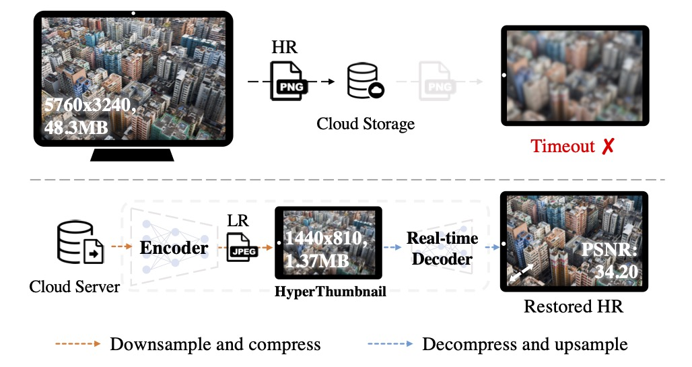

# [CVPR 2023] HyperThumbnail: Real-time 6K Image Rescaling with Rate-distortion Optimization

[Chenyang Qi](https://chenyangqiqi.github.io/)$^\*$, [Xin Yang](https://www.linkedin.com/in/abnervictor/)$^\*$, [Yingcong Chen](https://www.yingcong.me), and [Qifeng Chen](https://cqf.io)

&emsp;

  
  
The application of 6K image rescaling in the context of cloud photo storage on smartphones (e.g., iCloud). 

CLICK for the full description

> As more high-resolution (HR) images are uploaded to cloud storage nowadays, challenges are brought to cloud service providers (CSPs) in fulfilling latency-sensitive image reading requests (e.g., zoom-in) through the internet. To facilitate faster transmission and high-quality visual content, our HyperThumbnail framework helps CSPs to encode an HR image into an LR JPEG thumbnail, which users could cache locally. When the internet is unstable or unavailable, our method can still reconstruct a high-fidelity HR image from the JPEG thumbnail in real time.

## 🎏 Abstract

HyperThumbnail is a real-time 6K framework for rate-distortion-aware image rescaling.

CLICK for the full abstract

> Contemporary image rescaling aims at embedding a high-resolution (HR) image into a low-resolution (LR) thumbnail image that contains embedded information for HR image reconstruction. Unlike traditional image super-resolution, this enables high-fidelity HR image restoration faithful to the original one, given the embedded information in the LR thumbnail. However, state-of-the-art image rescaling methods do not optimize the LR image file size for efficient sharing and fall short of real-time performance for ultra-high-resolution (\eg, 6K) image reconstruction.
To address these two challenges, we propose a novel framework (HyperThumbnail) for real-time 6K rate-distortion-aware image rescaling. 
Our framework first embeds an HR image into a JPEG LR thumbnail by an encoder with our proposed quantization prediction module, which minimizes the file size of the embedding LR JPEG thumbnail while maximizing HR reconstruction quality. Then, an efficient frequency-aware decoder reconstructs a high-fidelity HR image from the LR one in real time. Extensive experiments demonstrate that our framework outperforms previous image rescaling baselines in rate-distortion performance and can perform 6K image reconstruction in real time.

## 🚧 Todo

- [ ] Release the training and inference codes
- [ ] Release the guidance documents for image rescaling and bitrate control
