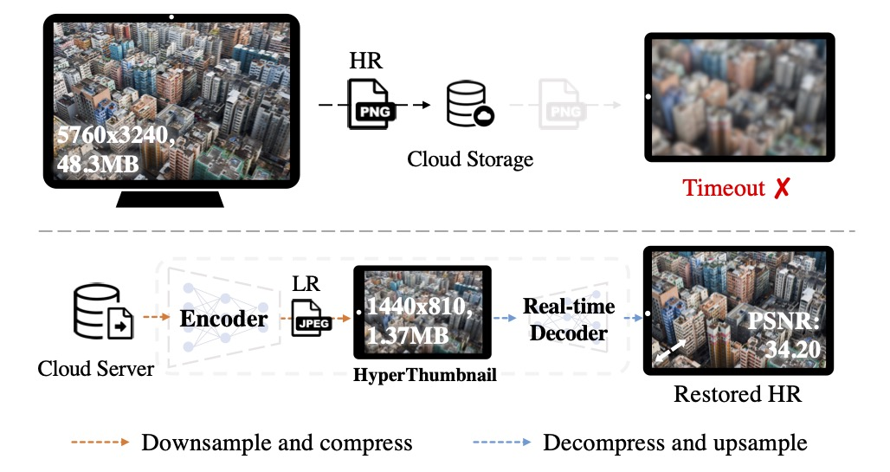

# [CVPR 2023] Real-time 6K Image Rescaling with Rate-distortion Optimization

[Chenyang Qi](https://chenyangqiqi.github.io/)\*, [Xin Yang](mailto:xin.yang@connect.ust.hk)\*, [Ka Leong Cheng](https://felixcheng97.github.io/), [Yingcong Chen](https://www.yingcong.me), and [Qifeng Chen](https://cqf.io)

<a href='https://arxiv.org/abs/2304.01064'></a> 

<div align=center>
  
  
The application of 6K image rescaling in the context of cloud photo storage on smartphones (e.g., iCloud). 
</div>

<details><summary>CLICK for the full description</summary>

> As more high-resolution (HR) images are uploaded to cloud storage nowadays, challenges are brought to cloud service providers (CSPs) in fulfilling latency-sensitive image reading requests (e.g., zoom-in) through the internet. To facilitate faster transmission and high-quality visual content, our HyperThumbnail framework helps CSPs to encode an HR image into an LR JPEG thumbnail, which users could cache locally. When the internet is unstable or unavailable, our method can still reconstruct a high-fidelity HR image from the JPEG thumbnail in real time.
</details>


## 🎏 Abstract

HyperThumbnail is the first real-time 6K framework for rate-distortion-aware image rescaling.
<details><summary>CLICK for the full abstract</summary>


> Contemporary image rescaling aims at embedding a high-resolution (HR) image into a low-resolution (LR) thumbnail image that contains embedded information for HR image reconstruction. Unlike traditional image super-resolution, this enables high-fidelity HR image restoration faithful to the original one, given the embedded information in the LR thumbnail. However, state-of-the-art image rescaling methods do not optimize the LR image file size for efficient sharing and fall short of real-time performance for ultra-high-resolution (\eg, 6K) image reconstruction.
To address these two challenges, we propose a novel framework (HyperThumbnail) for real-time 6K rate-distortion-aware image rescaling. 
Our framework first embeds an HR image into a JPEG LR thumbnail by an encoder with our proposed quantization prediction module, which minimizes the file size of the embedding LR JPEG thumbnail while maximizing HR reconstruction quality. Then, an efficient frequency-aware decoder reconstructs a high-fidelity HR image from the LR one in real time. Extensive experiments demonstrate that our framework outperforms previous image rescaling baselines in rate-distortion performance and can perform 6K image reconstruction in real time.
</details>


## 🚧 Todo

- [x] Release the training and inference codes
- [ ] Release the guidance documents for saving and loading the `.jpg` HyperThumbnail
<!-- - [ ] Release the guidance documents for image rescaling and bitrate control -->

## Preparations

Before run our training and inference codes, please install our requirements by:

```
pip install -r ./requirements.txt
```

And please install our modified version of [BaiscSR (Wang et al.)](https://github.com/XPixelGroup/BasicSR) by:

```
cd ./BasicSR
pip install -r ./requirements.txt
python setup.py develop
```

### Datasets and pretrained checkpoints

You can download example images [here](https://hkustconnect-my.sharepoint.com/:f:/g/personal/xyangbk_connect_ust_hk/EsGbMWqa2hxAtA8hBqJXo4MB3cIgKX2BZsLvKLge3i2kwg?e=wMzZNZ) and our pretrained checkpoint for 4x rescaling [here](https://hkustconnect-my.sharepoint.com/:u:/g/personal/xyangbk_connect_ust_hk/EcAaTY1MS0FLvfI7_0ex4tABlr88_kZFAUJuipc2NX8WwA?e=Co37eJ) using bash command 

<!-- <details><summary>CLICK for the bash command using github release</summary> -->
```
bash download.sh
```
<!-- <details> -->

## Training
You may prepare DIV2K and Set14 datasets following [docs](BasicSR/docs/DatasetPreparation.md).
Then start the `4x` rescaling training using the config in the `options/train/4x/HyperThumbnail_4x.yml`.

```
python ./run.py -opt ./options/train/4x/HyperThumbnail_4x.yml
```

Tips: you can also go to [BaiscSR](https://github.com/XPixelGroup/BasicSR) for detailed documentation of the training code.


## Inference

We provide a `4x` rescaling testing config in the `options/test/4x/HyperThumbnail_4x_test.yml`. You can start the testing by:

```
python ./run_test.py -opt ./options/test/4x/HyperThumbnail_4x_test.yml
```

## Export the jpeg HyperThumbnail

To export `.jpg` HyperThumbnail, you should install the [TorchJPEG (Ehrlich et al.)](https://gitlab.com/Queuecumber/torchjpeg/-/tree/master/) package. 

## 📍 Citation 

```
@inproceedings{qi2023hyperthumbnail,
    author    = {Qi, Chenyang and Yang, Xin and Cheng, Ka Leong and Chen, Ying-Cong and Chen, Qifeng},
    title     = {Real-Time 6K Image Rescaling With Rate-Distortion Optimization},
    booktitle = {Proceedings of the IEEE/CVF Conference on Computer Vision and Pattern Recognition (CVPR)},
    year      = {2023},
}
```

## Acknowledgement

- We build our training and testing code base on the [BaiscSR](https://github.com/XPixelGroup/BasicSR) toolbox. We are truely grateful for their outstanding works and contributions to the field. 
- We thank [TorchJPEG](https://gitlab.com/Queuecumber/torchjpeg/-/tree/master/) for the JPEG extension for pytorch that interfaces with libjpeg to allow for manipulation of low-level JPEG data.
- We thank [CompressAI](https://github.com/InterDigitalInc/CompressAI) for the implementation of Entropy Model.
